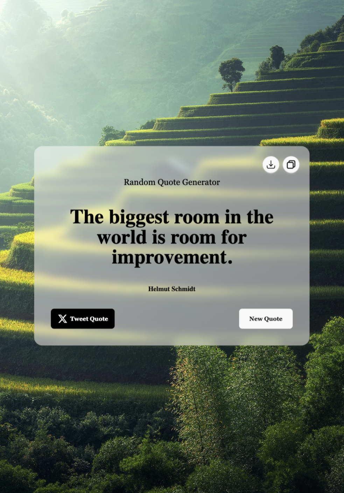

# Quote Generator

A sleek, modern web application that generates random inspiring quotes with beautiful background images. Users can easily copy quotes to clipboard, save them as images, or share them directly on Twitter.


## ✨ Features

- **Random Quote Generation**: Fetches unique quotes from a curated API
- **Dynamic Backgrounds**: Changes background image with each new quote
- **Copy to Clipboard**: Instantly copy quotes with attribution for sharing
- **Image Export**: Save your favorite quotes as beautifully formatted PNG images
- **Twitter Integration**: Share quotes directly to Twitter with one click
- **Responsive Design**: Works seamlessly across desktop and mobile devices
- **Elegant UI**: Clean interface with subtle animations and visual feedback

## 🚀 Live Demo

Experience the Quote Generator here: [Quote Generator](https://random-quote-generator-plum.vercel.app)

## 🛠️ Technologies Used

- HTML5
- CSS3 with Tailwind CSS
- JavaScript (ES6+)
- Canvas API for image generation
- External API integration
- Font Awesome icons

## 📱 Screenshots

<div style="display: flex; justify-content: space-between;">
    
    
</div>

## 💻 Local Development

1. Clone the repository:
   ```bash
   git clone https://github.com/yourusername/quote-generator.git
   ```

2. Navigate to the project directory:
   ```bash
   cd quote-generator
   ```

3. Open `index.html` in your browser or use a live server extension.

## 🔧 Configuration

The application uses the following API:
- Quote API: https://api.freeapi.app/api/v1/public/quotes/quote/random

You can modify API settings and other configurations in the `script.js` file.

## 🎨 Customization

- **Background Images**: Add your own images to the `assets` folder and update the `BACKGROUND_IMAGES` array in `script.js`
- **Styling**: Modify the styling in `output.css` or directly in the HTML file
- **Fonts**: The application uses Oswald and serif fonts by default, which can be changed in the CSS

## 📝 To-Do / Future Enhancements

- [ ] Add category filters for quotes
- [ ] Create user accounts to save favorite quotes
- [ ] Implement dark mode
- [ ] Add more social sharing options
- [ ] Create a quote search functionality

## 📄 License

This project is licensed under the MIT License - see the [LICENSE](LICENSE) file for details.

## 👏 Acknowledgements

- [Free API App](https://freeapi.app) for providing the quotes API
- [Tailwind CSS](https://tailwindcss.com) for styling utilities

---

Made with ❤️ by Kevin Rozario